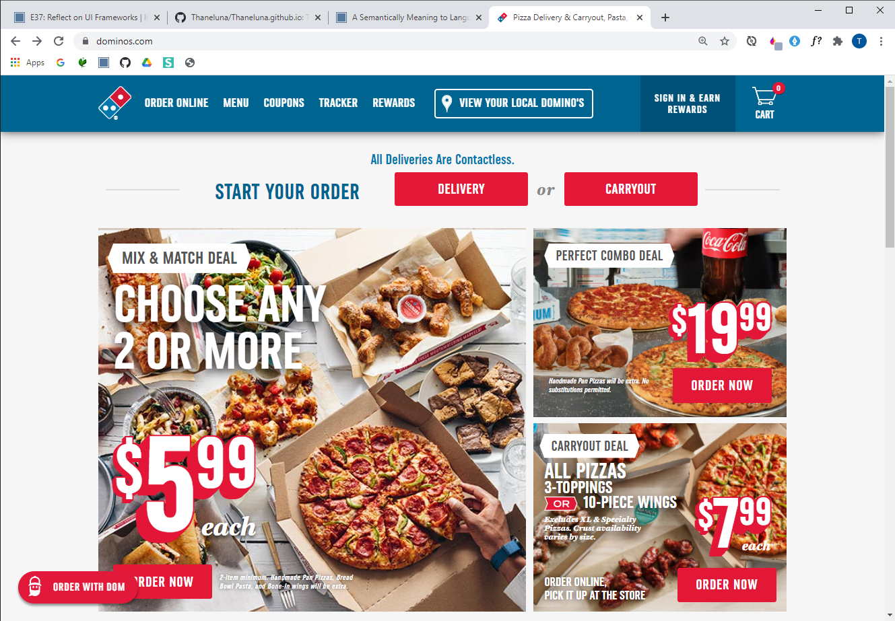

## Introduction
Semantic UI is like the dog with a bad behavior but has a good heart, a syntax that wants to be like English. To compare, it is rarely hard to come by to translate to the computer what it is you exactly want and where you want it. However, with the ui elements of Semantic UI it's purpose is exactly that. A bad behavior that makes you upset because you are missing a tiny word like creating a menu "menu", your IDE will not recognize this because you are telling them okay a menu, but what kind of menu? If you hadn't missed it, the "<b>ui</b> menu" was the missing word. Something like this makes my head hurt, and you will soon come to find out about why that is from the following sections. Despite that Semantic UI is a very good language that can be utilized to create webpages that you come across everyday, at least for me working with Semantic UI has changed my approach to how developers create websites and I am fond of such a computer language that can create a better semantically meaning to computer language.

## Why Semantic UI has semantic meaning to computer language
Semantic UI is a progressive way to build websites. It is a semantically, meaningful process that builds on the ideas of the English language. For example I want to take you into the progression of my recreation of the <a href="https://www.dominos.com/">Dominos</a> website. In the following image below, you will see an attempt at building the home page of the website. On one side you will see the original home page and a recreation of that.

As you can see, they are not nearly the same as the text shadows and font-sizes are not equal as well as the icons and buttons. However, doing this assignment helped me understand how to not only use the Google Chrome inspect which by the way is a great feature that many developers use to not only understand what is going on, but also can help to pick out the elements that require more detail and attention. Specifically, the buttons were easily implementable, semantic UI has great text for this. 
some text
 Here you can see that it is appropriate you surround such a button in a div to help with the structure of your code. Than again if you were to take it out you still would understand that you are creating a ui red button object. In addition, semantic UI is just like the English language. From the previous example, we used the word <b>"button"</b> the most common word in English that is assuming you are fluent in English or at least know what a big red square is. Semantic UI unlike the languages I've encountered has that Javascript feel to it, it can create a site through words like button or menu. Taking my example of the Domino's webpage, here is some code that I used to create the menu and hopefully you do too.
<blockquote>

  

    <a id="order" class="item">
      ORDER ONLINE
    </a>
    <a id="menu" class="item">
      MENU
    </a>
    <a id="coupons" class="item">
      COUPONS
    </a>
    <a id="tracker" class="item">
      TRACKER
    </a>
    <a id="rewards" class="item">
      REWARDS
    </a>
    

      <a id="sign-in" class="item">
        

          SIGN IN & EARN  REWARDS
        

      </a>
      <a id="cart" class="item">
        <i class="shopping cart icon"></i>
        
0

      </a>
    

  

</blockquote>
As you can see the task was not easy, but if I were to show this to a non-developer. They would easily understand what is going on. Why? Because the code looks like English under a menu, their are items and those items have similar words such as: item, an identification (id), icon, label. A few of the many ui elements that the website <a href="https://semantic-ui.com/kitchen-sink.html">Semantic</a> gives you. After seeing how common it is isn't it exciting how a computer language like Semantic UI is similar to that of the English language.

## Just like the English Language
Just like the English Language, I've had to make correction to grammatical errors that I find along the way. Well this also goes for writing Semantic UI. I can give one example of this, in my first encounter with Semantic UI, I was not sure why my menu was not working. Well this was because I was thinking ahead. Usually you would write 
, though at the time I was thinking that I have to write ui as that is the most important part about incorporating semantic ui in your html file. But instead of writing 
 I had not caught onto this until after a few changes to style to see what was going on, only then did I realize that I made a mistake with writing <ui> as the bracket identifier instead of 
. An example like mines shows you that it is natural to come across a misplaced ui element because this will also teach you that a ui element cannot work unless placed in the class statement. Hopefully from this, you will learn that just like the English language semantic UI has its little nuisances that can frustrate your brain.

## The Benefits
As a software engineer, you look for ideas to create readable code as you want others to be able to understand what is going on in your files or whatever it may be you are creating. Thus using a UI framework can help benefit that idea. From the readable class="ui", or to the way that it benefits in helping create a site without having to use raw HTML and CSS. The UI framework also helps with the development of front-end applications as you want the most basic design without having to write too much code. This is why using UI framework can be a benefit for software engineers. Oppositely what you don't want to do is write everything in html and CSS. In doing so, this can create a bunch of classes that are being referenced to in CSS, additionally it can cause confusion amongst how others read your code. So, on one end you want your application to be good, but also for the code itself to be good. That is why as a software engineer a UI framework is your basic development language when building a website.

## Closing
Finally, you have reached the ending of the language adventure that I went through of the highs and lows of the Semantic UI frameworks. Therefore, from these real-life examples that I went through, I hope that you'll be able to use a UI framework to not only benefit yourself, but also benefit how others view Software Engineers from an outside view.
 
 