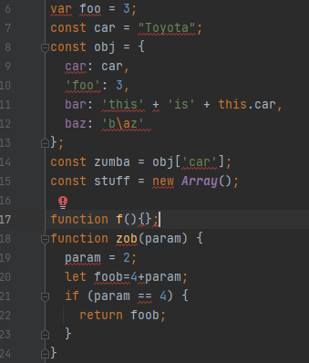

## Introduction
In my lifetime, I’ve used a lot of cheat codes. Yes, the kind of cheat codes you spam a bunch of buttons to ensure your success in video games, all while having fun, but what if I told you that there is also a cheat code to success that can apply to your quality of life. As a computer programmer, you are spending endless amounts of time looking at a screen and never notice an error before it is too late. There is one cheat code however that I have found helpful to find these errors while I can have fun typing away. With the help of ESLint in intelliJ, this is a cheat code that I have learned to love. It is just as fun as spamming a bunch of buttons because it is pretty much like the buttons are being spammed for you. With the easy setup, the <i>“markdown”</i> property to highlight lines of codes such as:
 
Also, the red bars on the right hand side of the code help you navigate the code and see what errors it gives you. Reasons such as these make me excited that there is a cheat code out there for computer programmers.

## The Coding Standards
Compared to a language you want to have your grammatical errors, pronunciation, and sentence structure down, and in computer language the same thinking applies. I only say this because if you are to find success, you can't do it without a form of structure. ESLint gives the structure you need, just as textbooks do for languages. This structure is looked to as the coding standards of a programming language. Without this a programming language would be like writing a bunch of words without syntax. Therefore, coding standards are enforced to ensure that the programmer and computer are on the same level and for readers to understand what you are writing on this line of code makes sense. Because of this, I agree that being able to have a form of structure for a computer programmer goes a long way to having to reuse code without being confused or debugging an issue without any stress. Thus brings me to the reason of what is the way to handle coding standards in your code and that my friend is a source called "ESLint".

## After the First Week and Impressions of ESLint
After the first week, I am excited to type more using ESLint. Not only does ESLint highlight your errors, but it also fixes them for you. All this although would not be possible without an editor like IntelliJ, this editor is easy to navigate and has an interface that's in the palm of my hands. Like video games I always loved a good story and whenever I open up IntelliJ with ESLint I know that this story has no errors. Although, when it does it gives you a notice just like a video game would. Like when you have crafting complications and it shows an error saying "minimum required amount of Wood 1/4". IntelliJ with ESLint does the exact same thing, as per in the top right hand corner, i.e. below:

The warnings are shown either with a red meaning bad and yellow meaning "it's okay to have it, but I wouldn't recommend it", and finally having fixed it seeing the green check mark makes me believe that the code is error free. For this reason, I find it useful that I am able to code willingly and not have to stress about following our coding standards because ESLint does the stressing out for me. Nonetheless, I wish there was one thing that ESLint could do and that is suppress warnings. Throughout this first week, we have been using the <i> underscore </i> functions and while it cuts code in half, I am never able to see the green checkmark because there are always multiple warnings saying "unresolved variable or type _". So, if only ESLint could add a feature such as to remove warnings on js files, then I would be happy that I can use _ without having to worry about that tiny warning.

## Lessons to Learn
To summarize, IntelliJ with ESLint is a game changer, throughout many courses I have used coding standards in editors like Eclipse where it highlights lines for me. Using ESLint it feels like I can learn Javascript programming while not having to worry about what lines of code is wrong. ESLint is the type of cheat code that gives you the warnings, errors, and positives in a program. It will mash the buttons or in this case the lines for you as you would in a video game and give you reasons to fix it, and like a video game you can have fun while completing it. Therefore, I believe that ESLint is a great coding standard source that helps me as a programmer develop my language skills as I would any other language. 