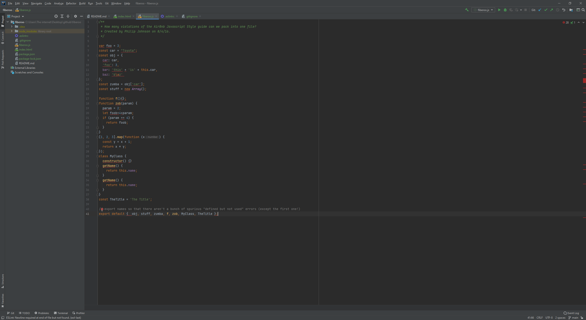

## Introduction
In my lifetime, I’ve used a lot of cheat codes. Yes, the kind of cheat codes you spam a bunch of buttons to ensure your success in video games, all while having fun, but what if I told you that there is also a cheat code to success that can apply to your quality of life. As a computer programmer, you are spending endless amounts of time looking at a screen and never notice an error before it is too late. There is one cheat code however that I have found helpful to find these errors while I can have fun typing away. With the help of ESLint in intelliJ, this is a cheat code that I have learned to love. It is just as fun as spamming a bunch of buttons because it is pretty much like the buttons are being spammed for you. With the easy setup, the <i>“markdown”</i> property to highlight lines of codes such as:

