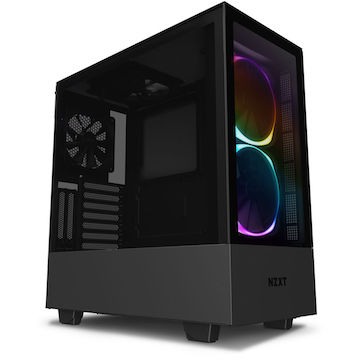
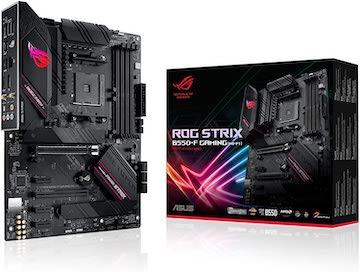
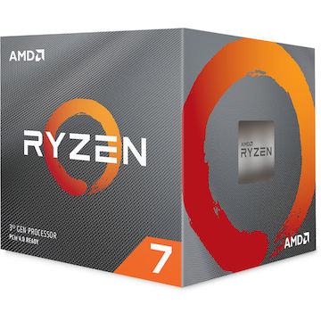
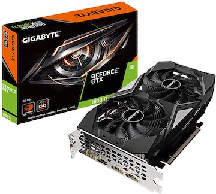
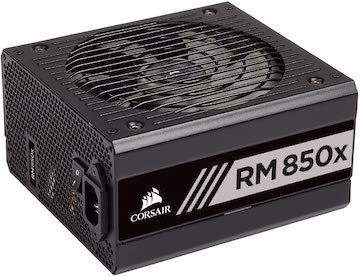

PC building is not easy. There are a lot of factors that you must take into account. I spent over 4 days building my PC with all the photos of the parts I used above. My previous PC was pre-built and $299, the CPU was slow and the VGA was not up to date. I paid for this PC $1300 no extra fees because of the pre-built nonsense. Orginally, the parts were listed much more cheaper a few years ago, but since demands are high for most parts, there hardly isn't any in stock and if so they are ranged around $600 for one piece. Building a PC can be rather expensive, but it is the journey of peeling back that film over the tempered glass that makes the process worth it.

Building a PC is a grueling process, in the process, I learned that hardware is fragile. It took me a few days to only realize that a part was defective. I also did fry the motherboard because of static electric build up I had in my body. I also had to do a few hours of research beforehand, but it was all worth it in the end. Now when I run games I can run it with a smooth 60+ FPS with high/ultra graphics, and I can even open up other applications while playing games; a feature that my old PC did not possess. This mini project of mines helped show that hardware and software capabilities go hand in hand. If you have cheap hardware, you pay the price by either running games in low FPS with high input lag, or not even be able to run the game at all. So as a word of advice for any takers in building a PC make sure to have the right materials, you can ask your friends if you can test your parts with their parts and even go out of your way to buy other motherboards, CPUs, VGAs, PSUs and return the items when needed because if a part is defective you won't find the answer without having a spare part. Most of all, don't stress over the challenging things, instead do more research and take a breath before you do any significant project such as this. 

  <a href="https://www.amazon.com/NZXT-H510-Elite-Dual-Tempered-Water-Cooling/dp/B07TD9VTVQ/ref=sr_1_1_sspa?crid=34AY8TPCQ0Y73&dchild=1&keywords=nzxt+h510+elite&qid=1611205947&sprefix=nzxt+h510+e%2Caps%2C255&sr=8-1-spons&psc=1&spLa=ZW5jcnlwdGVkUXVhbGlmaWVyPUExTDBNWEJIODQ0WDBIJmVuY3J5cHRlZElkPUEwNTQ2OTA5TkdGTzc3TUY5TDlKJmVuY3J5cHRlZEFkSWQ9QTA4MjAwNTNaUDZBVks5WDc5WkMmd2lkZ2V0TmFtZT1zcF9hdGYmYWN0aW9uPWNsaWNrUmVkaXJlY3QmZG9Ob3RMb2dDbGljaz10cnVl">NZXT H510 Elite</a>

  <a href="https://www.amazon.com/ASUS-ROG-B550-F-Motherboard-Addressable/dp/B088W7RKVZ/ref=sr_1_4?dchild=1&keywords=asus+motherboard&qid=1611207160&sr=8-4">ASUS ROG Strix Motherboard</a>

Below are hyperlinks to the PC parts above:

